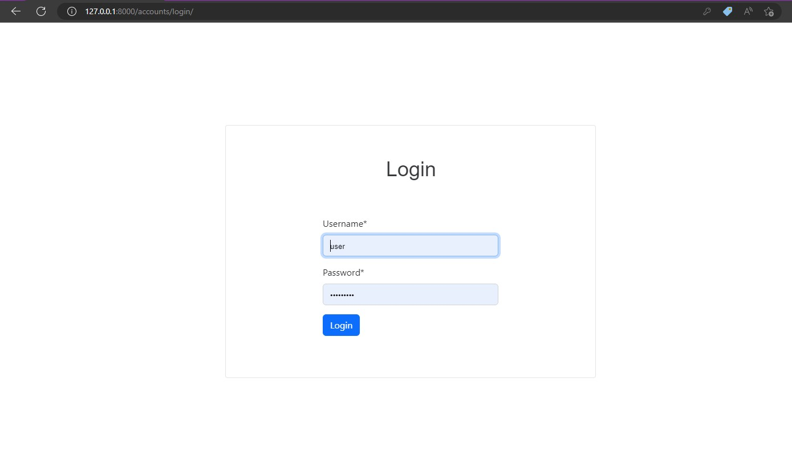

# CSV Fake data generator on Django

Project for generating fake data with custom selection of fields and the ability to download a csv file

# Test user:
* login: user
* password: user12345

## Demo





## Features

* Instant creation of fields for csv file from the proposed 5 data types
* Select the number (rows) of random values generated
* Download csv file

## Installation

Python3 must be already installed

```shell
git clone https://github.com/Glasis9/csv_fake_data_generator_on_django.git
cd csv_fake_data_generator_on_django
python3 -m venv venv
source venv/bin/activate
pip install -r requirements.txt
python manage.py runserver  # starts Django Sever
```
